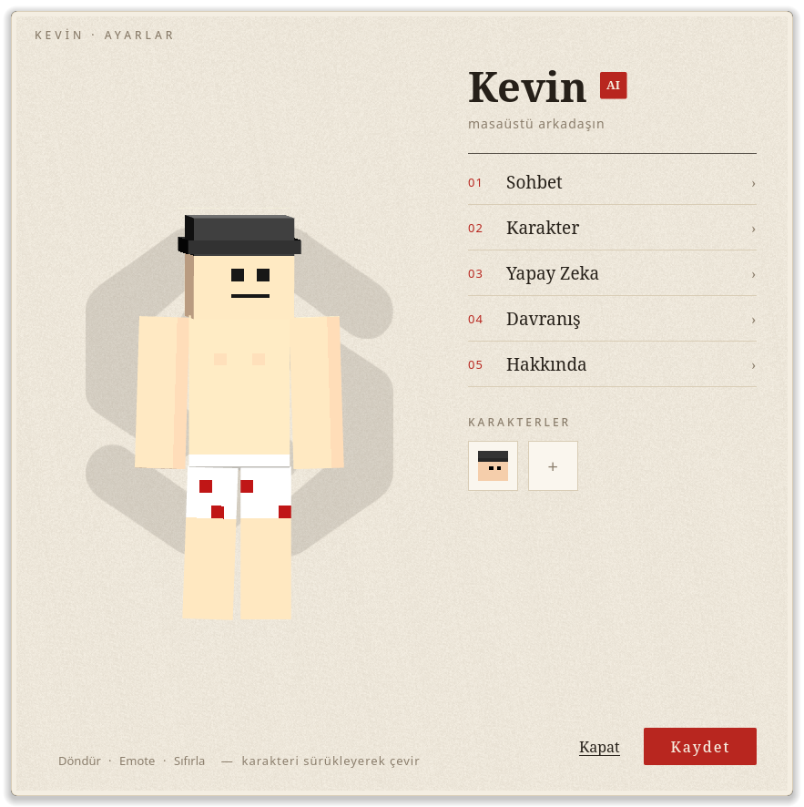

# Kevin

[Türkçe](../../README.md) · [English](README.en.md) · **Español** · [Français](README.fr.md) · [Deutsch](README.de.md) · [Português](README.pt.md) · [Русский](README.ru.md) · [العربية](README.ar.md) · [हिन्दी](README.hi.md) · [اردو](README.ur.md) · [Bahasa Indonesia](README.id.md)

Un amigo con IA que vive en tu escritorio, habla, te conoce y puede usar tu ordenador.
Un personaje 3D al estilo Minecraft: pasea por la pantalla, se sienta apoyado en el borde y puedes
agarrarlo y lanzarlo. Di su nombre y se gira hacia ti y habla en voz alta.

<p align="center"></p>

## Descargar

Desde la [última versión](https://github.com/Livicianaa/Kevin/releases/latest):

| Sistema | Archivo | Cómo abrirlo |
|---|---|---|
| Windows 10/11 | `Kevin-Kurulum.exe` | Ejecuta el instalador. Aparece un acceso directo de Kevin en el escritorio. |
| Windows (sin instalar) | `Kevin-Windows.zip` | Extrae en una carpeta y haz doble clic en `Kevin\Kevin.exe`. |
| Linux | `Kevin-x86_64.AppImage` | Clic derecho > Propiedades > marcar como ejecutable, luego doble clic. Terminal: `chmod +x Kevin-x86_64.AppImage && ./Kevin-x86_64.AppImage` |

Si Windows dice "Windows protegió su PC", elige "Más información" > "Ejecutar de todas formas".
Al primer inicio Kevin se prepara unos segundos (pantalla de inicio) y luego cae a tu escritorio.

## Primera configuración: clave de IA

Kevin necesita un servicio de IA para hablar. Cada uno usa su propia clave; solo se guarda en tu equipo.

1. Al primer inicio Kevin abre sus ajustes solo (después: **clic derecho** en el personaje > **IA**).
2. Elige un proveedor y pulsa **Conseguir clave**. Clave gratis en Groq: [console.groq.com/keys](https://console.groq.com/keys)
3. Pega la clave. La lista de modelos se carga sola; si la clave es correcta dice "Conectado".
4. **Guardar**.

Para usarlo sin internet elige **Local (Ollama)**: instala [Ollama](https://ollama.com/download) y descarga un
modelo (`ollama pull qwen3:8b`).

## Qué puedes probar

- Di **"Kevin"** (o clic central sobre él) y habla: "¿qué tiempo hace?", "pon lo-fi en YouTube",
  "mira mi pantalla, ¿qué es esto?"
- **Háblale de ti:** "me llamo Ali, tomo café sin azúcar". Lo recuerda; corrígelo y aprende. En la página Chat
  del menú ves y borras lo que sabe.
- **Pide código:** "escribe un dado en Python". No lo lee en voz alta; lo teclea letra a letra en su ventana.
- **Cámara** (si la activas en ajustes): "mírame", "soy yo, recuérdame", "¿qué tengo en la mano?"
- **Música:** pon una canción y baila (no con vídeos). Al hablar se mueve según su ánimo.
- **Física:** agárralo, arrástralo, lánzalo; tira despacio de un brazo y tropieza. Se levanta solo.
- **Menú (clic derecho):** añadir skins (skin de Minecraft 64x64, `+`), tamaño, idioma, comportamiento. Esc cierra.
- **11 idiomas:** Türkçe, English, Español, Français, Deutsch, Português, Русский, العربية, हिन्दी, اردو,
  Bahasa Indonesia. La voz de cada idioma se descarga la primera vez (~60 MB).

## Requisitos

- Linux de 64 bits o Windows 10/11, micrófono, altavoces
- Se recomiendan 8 GB de RAM. Kevin mide tu equipo en cada inicio; en equipos modestos se mueve menos y
  usa menos fotogramas.
- Internet para la IA (u Ollama en local)

## Límites conocidos

- **Windows:** bailar con música, controlar la pantalla y la cámara por ahora solo funcionan en Linux. Chat,
  voz, menú, skins y física funcionan también en Windows.
- **Linux:** probado sobre todo en Hyprland. En otros escritorios la transparencia y "siempre encima" pueden variar.
- Fresh Animations no está incluido (su licencia no permite redistribuirlo); Kevin camina con animaciones
  propias. Si lo tienes, pon `player.jem` en la carpeta `bin/cem/` de la aplicación.

## ¿Dónde están los ajustes y datos?

| | Linux | Windows |
|---|---|---|
| Ajustes, clave, memoria, historial, skins | `~/.config/kevin-pc-version/` | `%APPDATA%\kevin-pc-version\` |

Borra esa carpeta para reiniciar a Kevin.

## Desde el código (desarrolladores)

Kevin tiene dos partes: el **cuerpo** (`body/`, Godot 4.7 + física Jolt) y el **cerebro** (Electron: voz,
chat, herramientas). El cuerpo arranca el cerebro solo.

```bash
npm install
npm run build:skin
body/run.sh
```

`bin/` (voz Piper, reconocimiento whisper.cpp y sus modelos) no está en git por su tamaño; la lista está en el
[README en turco](../../README.md). Paquetes: `scripts/paketle.sh [linux|windows|hepsi]`.

## Gracias

Emotecraft emotes (CC0), Quaternius Universal Animation Library 2 (CC0), Piper (MIT), whisper.cpp (MIT),
Godot (MIT), Electron (MIT), Anton (OFL), Noto.

---

Created by Liviciana · Codemisk
